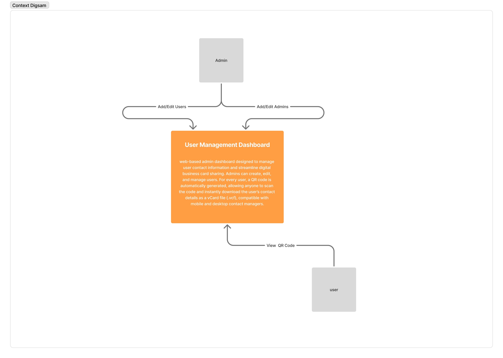
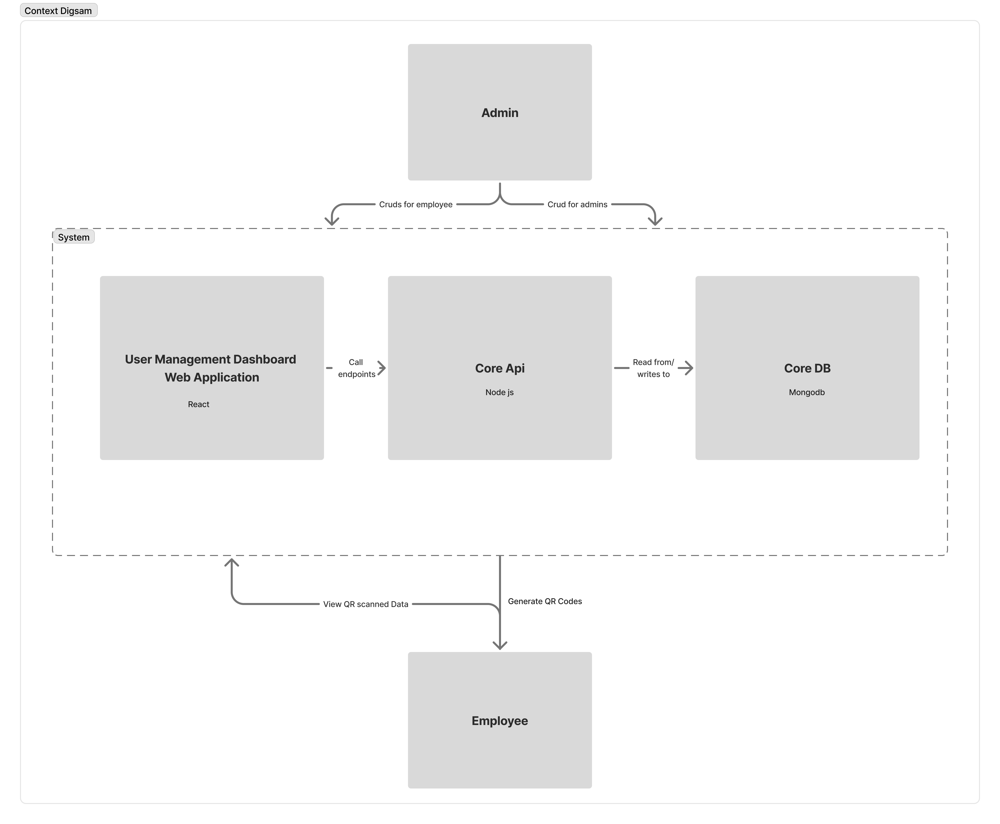

# User Management Dashboard with QR-Based vCard Sharing

## 1. Overview

This project is a web-based admin dashboard designed to manage user contact information and streamline digital business card sharing. Admins can create, edit, and manage
users. For every user, a QR code is automatically generated,
allowing anyone to scan the code and instantly download the
user’s contact details as a vCard file (.vcf), compatible with
mobile and desktop contact managers.

## 2. Context

Traditional methods of sharing contact information rely on printed business cards, which are costly, prone to loss, and environmentally unfriendly. Many existing solutions are either too complex or not optimized for cross-platform compatibility.

The goal is to design a modern, scalable, and responsive web application that simplifies user contact management and eliminates printed cards through QR code–based digital sharing.

## 3. Non-Functional Requirements

- **Security**: Admin access via authentication; data access
restricted by role.
- **Scalability**: Ability to handle thousands of users efficiently.
- **Performance**: QR and vCard generation must be near-instant (<500ms).
- **Availability**: 99.9% uptime for admin dashboard and QR endpoints
- **Compatibility**: vCard file must open properly in iOS, Android, and Windows Contacts.
- **Responsiveness**: UI should adapt seamlessly to mobile, tablet, and desktop screens.

## 4. High Level Design

The User Management Dashboard will be developed as a React-based Single Page Application (SPA) with a RESTful API (or mock API during development). The frontend will handle QR code generation and vCard download links dynamically.

### Container Diagram

### Architectural Style

#### 1. Login Screen (Admin Only)
- Secure admin authentication (future integration with JWT or OAuth).

#### 2. Users List Screen
- Table displaying users: **Name**, **Email**, **Phone**.  
- Actions: **View Details**, **Edit**, **Delete**, **Add User**.

#### 3. Create/Edit User Screen
- **Form Fields**:  
  - Full Name, Job Title, Email, Phone Number (required)  
  - Company, Website, Address (optional)  
- Actions: **Save**, **Cancel**

#### 4. User Details Screen
- Display full user info.  
- Show or download or share **QR Code**.  
- Back navigation to user list.

#### 5. Admins List Screen
- Table displaying admins: **Name**, **Email**.  
- Actions: **View Details**, **Edit**, **Delete**, **Add Admin**.

#### 4. Admin Details Screen
- Display full admin info.   
- Back navigation to admin list.

### Technology Stack

- **Frontend Framework**: React.js (with TypeScript)  
- **UI Library**: Tailwind CSS / Shadcn UI  
- **vCard Generation**: `vcards-js` or custom generator  
- **State Management**: React Query / Redux Toolkit  
- **Form Handling**: React Hook Form + Yup (validation)  
- **Backend**: Node js + Express , MonogoDB
- **Deployment**: Digital Ocean

## 5. Timeline

### Phase 1: Component Development (Week 1)
- Project scaffolding with React + Tailwind + TypeScript.  
- Create **reusable UI components** (buttons, inputs, forms, tables, modals).  

### Phase 2: Views and Pages (Week 2)
- Build **views and pages**:  
  - Login Page  
  - Users List Page  
  - Create/Edit User Page  
  - User Details Page  
- Assemble components into functional page layouts.

### Phase 3: Backend Integration (Week 3)
- Integrate with **Node.js backend API** for CRUD operations.  
- Implement **QR code generation** and **vCard download functionality** using live data.

### Phase 4: Testing & Deployment (Week 4)
- Conduct **UI and functional testing** (manual + basic automated).  
- Validate cross-platform vCard compatibility (iOS, Android, Windows).  
- Responsive UI fixes and basic security updates.  
- Deploy.

### Phase 1: Discovery and Planning (July 2024 - August 2024)

- Finalize requirements and gather detailed specifications.
- Design the architecture and create detailed technical documentation.

### Phase 2: Initial Development (September 2024 - October 2024)

- Set up the project structure and configure the development environment.
- Implement core modules: Home, Login, Search, and Profile.

### Phase 3: Feature Development (October 2024 - November 2024)

- Implement remaining modules: Delivery, Pickup, Restaurant, Shopping Cart, and Menu Item.
- Integrate real-time updates using WebSockets.
- Conduct performance and scalability testing.

### Phase 4: Testing and Deployment (November 2024)

- Perform comprehensive end-to-end testing (manual and automated.)
- Deploy to staging environment.
- Deploy to production and monitor for issues.

## 6. Risks and Open Questions

### Risks

- **vCard Format Issues**: Ensuring compatibility across iOS, Android, and Windows contact managers.  
- **Security**: Proper authentication and data privacy need to be handled when backend integration happens.

### Open Questions

- Should the **vCard URL be public** or require authentication?  
- Will future versions include **analytics or usage tracking**?  
- Should admins be able to **customize QR code design (colors, logo)**?

- **UI Wireframes (Figma)** – [https://www.figma.com/design/2ehGNFPSbEIZy1T0zG1kfm/BAB-SAMHAN--dashboard?node-id=0-1&t=Jm48yRbS3JIJaP0H-1]  
- **Libraries Reference**:  
  - [qrcode.react](https://github.com/zpao/qrcode.react)  
  - [vcards-js](https://github.com/enesser/vCards-js)

