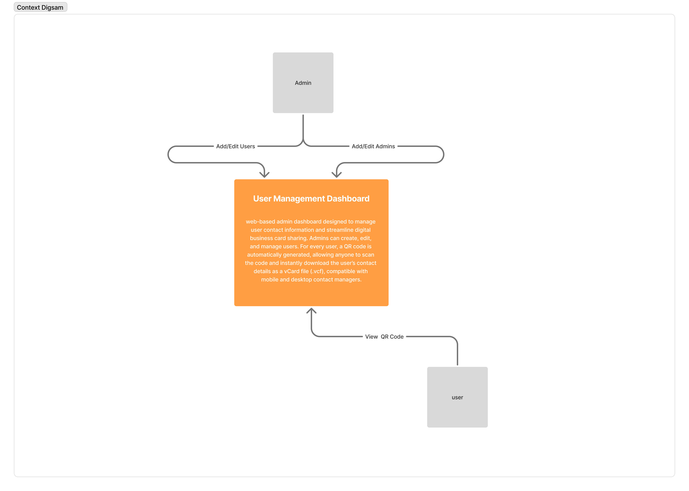

# Project Spec

## 0. Project Overview

The User Management Dashboard with QR-Based vCard Sharing is a web-based admin dashboard designed to manage employee contact information and enable QR code–based digital business card sharing.

Administrators can create, edit, and manage employee profiles. For every employee, a QR code is automatically generated by the backend, allowing anyone to scan it and instantly download the employee’s contact details as a vCard (.vcf) file, compatible with iOS, Android, and desktop contact managers.

The goal is to build a secure, scalable, and responsive web application that replaces printed business cards with a digital alternative.

## 1. User Management System

_This section describes the entire system, including users, applications, and data stores. The admin dashboard we’re designing is part of this system._

### System Context

#### System Users

- **👩🏻 Admin** — Authorized administrators who log in to the dashboard to create, edit, and manage employee contact information.
- **👨🏻‍💻 Employee (Read-Only)** — Employees whose contact information is managed by admins. They don’t interact directly with the system.
- **📱 External User (Contact Scanner)** — Any user who scans the QR code to download the employee’s vCard (no authentication required).

#### External Systems

- **QR & vCard Generation Service** — Backend service that dynamically generates QR codes and vCard files when requested.

#### System Context Diagram

### System Containers

- **Admin Dashboard [React SPA]** — The application used by admins to manage employees and view QR codes.
- **Backend API [Node.js + Express]** REST API responsible for CRUD operations, QR code generation, and vCard file generation.
- **Database [MongoDB]**  Stores admin and employee data (name, email, phone, job title, etc.).
- **QR & vCard Service** Backend logic (integrated within the Node.js API) that generates QR codes and serves vCard files.

#### Container Diagram

---

### UI Designs

👉🏽 Check out the [Figma spec](https://www.figma.com/design/2ehGNFPSbEIZy1T0zG1kfm/BAB-SAMHAN--dashboard?node-id=0-1&t=Jm48yRbS3JIJaP0H-1).

## Functional Requirements

### Authentication
- Admins must log in to access the dashboard.  
- Secure login with email & password (**JWT-based in the future**).

### User Management
- Admins can create, edit, and delete employee profiles.  
- **Required fields**: Full Name, Job Title, Email, Phone Number.  
- **Optional fields**: Company, Address, Website.

### QR Code and vCard
- The backend automatically generates a QR code for each employee.  
- QR code links to a downloadable **vCard (.vcf)** file.  
- Admins can view or download the QR code image.

---

## Architectural Requirements

- **Frontend**: React SPA with TypeScript & Tailwind CSS.  
- **Backend**: Node.js + Express REST API.  
- **Database**: MongoDB.  
- **Security**: Admin-only access, basic authentication.

### Architectural Requirements

👉🏽 Check out the [requirements doc](requirements.md).
