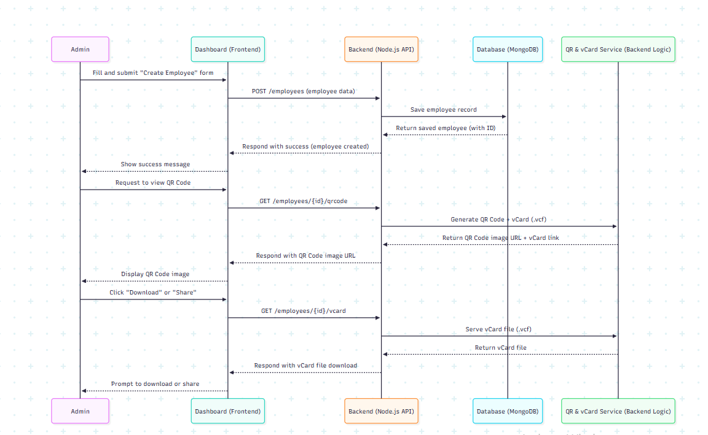

# Create user and download or share Sequence

sequenceDiagram
    participant A as Admin
    participant D as Dashboard (Frontend)
    participant B as Backend (Node.js API)
    participant DB as Database (MongoDB)
    participant QR as QR & vCard Service (Backend Logic)

    %% Admin Creates Employee
    A->>D: Fill and submit "Create Employee" form
    D->>B: POST /employees (employee data)
    B->>DB: Save employee record
    DB-->>B: Return saved employee (with ID)
    B-->>D: Respond with success (employee created)
    D-->>A: Show success message

    %% Request QR Code Generation
    A->>D: Request to view QR Code
    D->>B: GET /employees/{id}/qrcode
    B->>QR: Generate QR Code + vCard (.vcf)
    QR-->>B: Return QR Code image URL + vCard link
    B-->>D: Respond with QR Code image URL
    D-->>A: Display QR Code image

    %% Download or Share vCard
    A->>D: Click "Download" or "Share"
    D->>B: GET /employees/{id}/vcard
    B->>QR: Serve vCard file (.vcf)
    QR-->>B: Return vCard file
    B-->>D: Respond with vCard file download
    D-->>A: Prompt to download or share

## Mermaid Live URL

https://mermaid.live/edit#pako:eNptUkuPmzAQ_iuWz3nZJBCsKtJmqaqcGjWHSlUuBjtgLWBqD21plP9eAybqbsLJzHyvGc0VZ1pIzLCVP1tZZzJRPDe8OtfIfaCglOirEdKgY8kzWcka0MlDR0zDDahMNdx1XlsLupLmsfNdpuilaZ5QtJHo5Xh47CT7x9qRd30Ei06dBelSjpDJd77beSOGXkuVvSE9ZE9bAO2xHuCgkzVzE9XC-jkPCeK1QJ9Sg5Y7Zz4YIlVftKk4qElmIjudZM_QFwkINPASpZ03PSQjMtnP35l9k9Ca2oMGzoPihzHHgPcspt-_hZH1AfrUaiJmur6o51P8vznPekRPq-s9_MZdtEL_fodFlbSW5xLPsANUXAl3Xtde4YyhcCd0xsw9BTdvZ3yubw7HW9Cnrs4wA9PKGW4bwWE6RcwuvLT36mehQJt7sdTc7RGzK4au6Q85Vxac5JAo7-utKV25AGgsWy779iJXULTpItPV0ipRuAMrfsXhMqThltNAhlHAN0EgspTE2wtdk4uIVoRyfLvNsLvDXvUPZoQEi3hL400Urkm8opt4hjvM5pQsAhputiQOwiAgQRA52l-t3SRkQcmW0nAVbUhE13Q96P0Yen4go9u88H-3f0QMLqc

